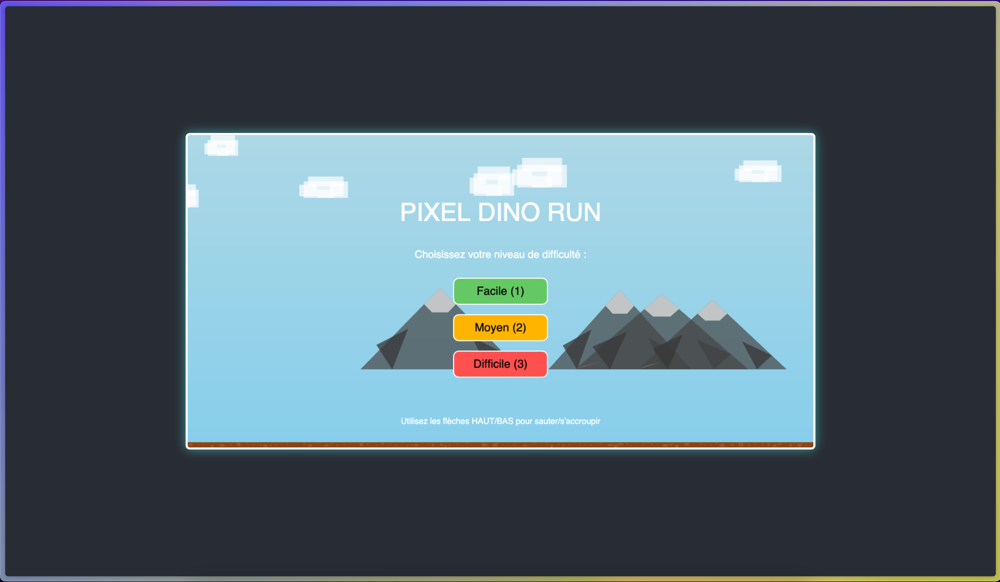
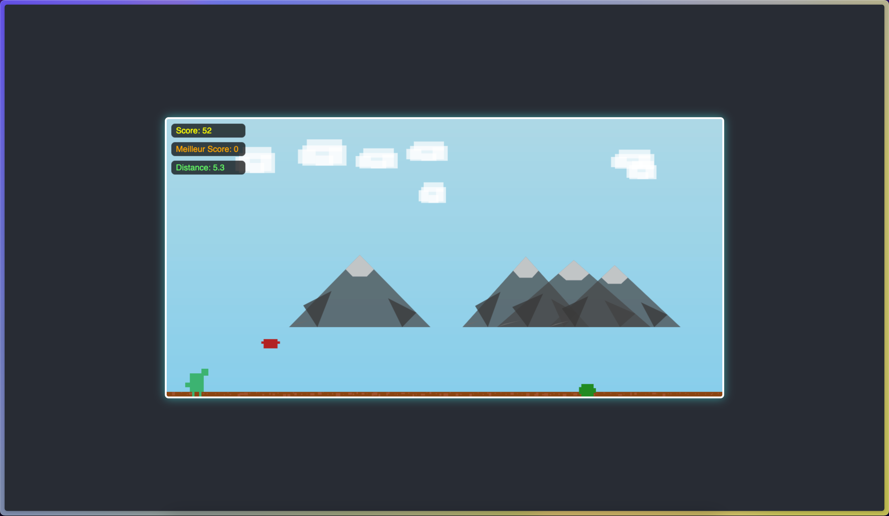

# Pixel Dino Run (English)

A captivating endless runner game featuring a pixelated dinosaur and interesting, dynamically scrolling backgrounds.

## Folder Structure

pixel-dino-run/
├── PROMPT.md
├── README.md
├── assets/
│   ├── game_play_screen1.png
│   └── game_play_screen2.png
└── public/
    ├── index.html
    └── sketch.js

## 📷 Game screens

## How to Play

1.  **Save the files:**
    * Go on [Game Link](https://pixel-dino-run-by-hishaaam.web.app) or

    * Create a folder named `pixel-dino-run`.
    * Inside `pixel-dino-run`, create a subfolder named `public`.
    * Save the `index.html` file into the `public` folder.
    * Save the `sketch.js` file into the `public` folder.
    * Save this `README.md` file and the `PROMPT.md` file directly into the `pixel-dino-run` folder.

2.  **Open the game:**
    * Navigate to the `public` folder.
    * Open `index.html` in your web browser (e.g., Chrome, Firefox, Edge).

## Game Instructions

* **Start Game:** Press the **SPACEBAR** on the start screen.
* **Jump:** Press the **SPACEBAR** to make the dinosaur jump over obstacles.
* **Dodge:** Avoid colliding with cacti and flying birds.
* **Score:** Your score increases as you survive longer.
* **Restart:** After "Game Over", press the **SPACEBAR** to play again.

## Features

* **Pixelated Graphics:** Simple, charming pixel art style for the dinosaur and obstacles.
* **Parallax Backgrounds:** Multiple layers of scrolling backgrounds create a sense of depth and movement.
* **Dynamic Obstacles:** Randomly generated cacti and birds provide varied challenges.
* **Score Tracking:** Keep track of how long you survive.
* **Responsive Design:** The canvas adapts to the browser window size.

Enjoy the game!

# Pixel Dino Run (French)

Un jeu de course sans fin captivant avec un dinosaure pixélisé et des arrière-plans dynamiques et défilants.

## Structure des dossiers

pixel-dino-run/
├── PROMPT.md
├── README.md
├── assets/
│   ├── game_play_screen1.png
│   └── game_play_screen2.png
└── public/
    ├── index.html
    └── sketch.js

## 📷 Game screens

## Comment jouer

1.  **Enregistrez les fichiers :**
    * Clicker sur le lien suivant : [Game Link](https://pixel-dino-run-by-hishaaam.web.app) or

    * Créez un dossier nommé `pixel-dino-run`.
    * À l'intérieur de `pixel-dino-run`, créez un sous-dossier nommé `public`.
    * Enregistrez le fichier `index.html` dans le dossier `public`.
    * Enregistrez le fichier `sketch.js` dans le dossier `public`.
    * Enregistrez ce fichier `README.md` et le fichier `PROMPT.md` directement dans le dossier `pixel-dino-run`.

2.  **Ouvrez le jeu :**
    * Naviguez vers le dossier `public`.
    * Ouvrez `index.html` dans votre navigateur web (par exemple, Chrome, Firefox, Edge).

## Instructions du jeu

* **Sélection du niveau :** Sur l'écran de démarrage, utilisez les touches numériques **1, 2 ou 3** pour choisir votre niveau de difficulté (1: Facile, 2: Moyen, 3: Difficile).
* **Démarrer le jeu :** Après avoir sélectionné le niveau, le jeu commencera automatiquement.
* **Sauter :** Appuyez sur la **flèche HAUT** du clavier pour faire sauter le dinosaure par-dessus les obstacles.
* **S'accroupir :** Appuyez sur la **flèche BAS** du clavier pour que le dinosaure s'accroupisse et évite les obstacles volants.
* **Éviter :** Évitez de entrer en collision avec les cactus et les oiseaux volants.
* **Score :** Votre score augmente à mesure que vous survivez plus longtemps.
* **Redémarrer :** Après "Game Over", appuyez sur la **barre d'ESPACE** pour rejouer.

## Fonctionnalités

* **Graphismes pixélisés :** Style artistique simple et charmant pour le dinosaure et les obstacles, avec un dinosaure plus détaillé.
* **Arrière-plans parallaxe :** Plusieurs couches d'arrière-plans défilants créent une sensation de profondeur et de mouvement.
* **Obstacles dynamiques :** Des cactus et des oiseaux générés aléatoirement offrent des défis variés.
* **Suivi du score :** Gardez une trace de votre durée de survie.
* **Niveaux de difficulté :** Choisissez entre les modes Facile, Moyen et Difficile pour une expérience de jeu personnalisée.
* **Nouvelles actions :** Le dinosaure peut sauter (flèche HAUT) et s'accroupir (flèche BAS).
* **Conception réactive :** Le canevas s'adapte à la taille de la fenêtre du navigateur.

Amusez-vous bien !
